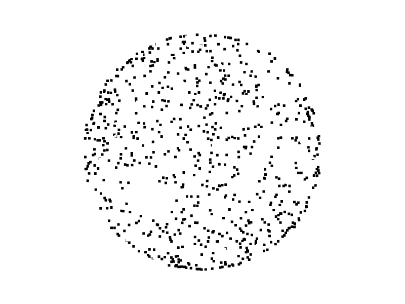
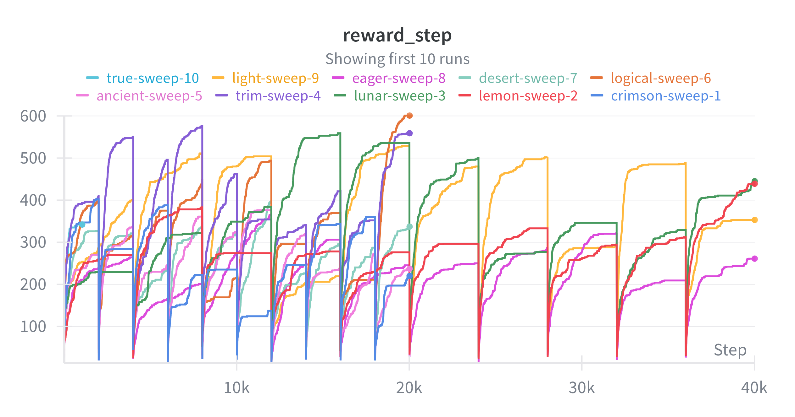
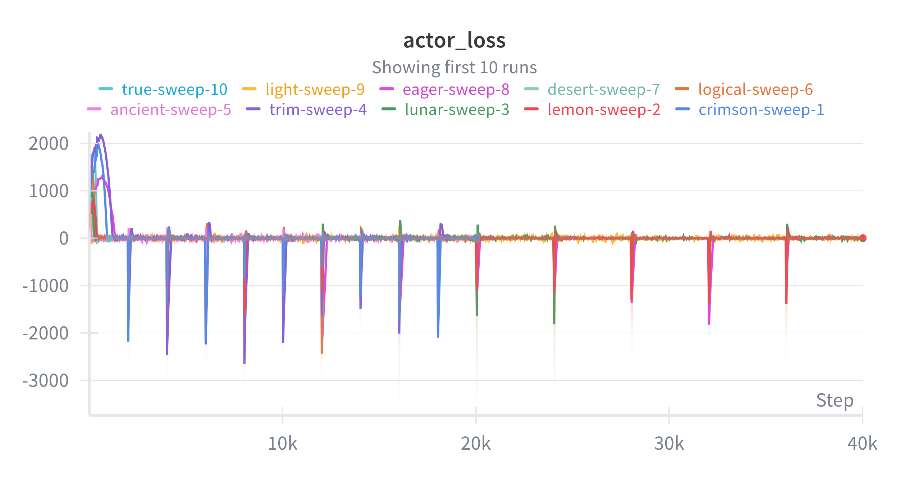

# RARL_Project
# DigiGAT : Digital Twin Synthesis via Geometry-Aware RL and Topological MDPs
**DA25D900-Sukanya Naik & DA24S012-Omkar Tupe**


1. Install the required libraries in  environment using below command:
```
pip install -r requirements.txt
```
## Project Structure
- [region_tnn_sweeps.py](region_tnn_sweeps.py) - Main file containing TNN based Actor critic algorithm
- [run_sweep.py](run_sweep.py) – sweep files
- [sweep_config_final_fixed.yaml](sweep_config_final_fixed.yaml) - Hyperparameter file





Actor loss across all runs starts with high volatility, then stabilizes near zero, but shows regular sharp negative spikes likely due to periodic scheduled network updates.​
